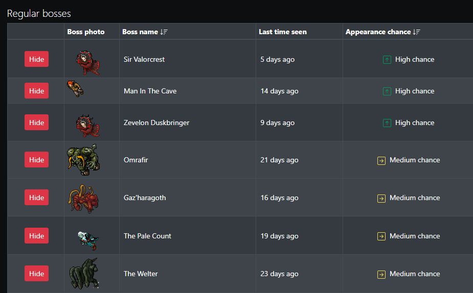
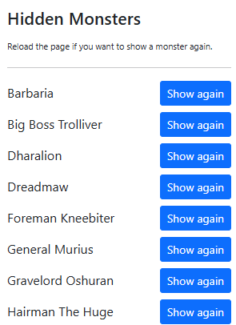

### README.md

# Tibia Statistic Filter

**Tibia Statistic Filter** is a fan-made browser extension designed for Tibia players. It allows users to enhance their browsing experience by hiding specific monsters from boss tables on website **Tibia Statistic**. Users can also easily manage hidden monsters and restore them as needed.

---

## Features

- **Hide Monsters**: Adds a "Hide" button next to each monster in the boss table, letting you temporarily hide it from view.
- **Manage Hidden Monsters**: A management interface is available to view and "Show Again" monsters that were previously hidden.
- **Popup Management**: Manage your hidden monsters directly from the extension popup.

#### Show only desired bosses

#### Re-add hidden monster into the list

---

## Installation

1. Clone or download the repository.
2. Open your browser and navigate to the extensions management page:
   - For Chrome/Edge: Go to `chrome://extensions/` or `edge://extensions/`.
   - For other Chromium-based browsers, refer to their specific instructions.
3. Enable **Developer Mode** in the top-right corner.
4. Click **Load unpacked** and select the ´src´ folder containing the extension's source files.
5. The extension should now be ready to use.

---

## How to Use

1. Open the boss hunter [Tibia Statistic](https://www.tibia-statistic.com/bosshunter/details/collabra?sortOrder=Appearance_desc) page
2. Click the "Hide" button next to a monster you wish to hide.
3. Manage hidden monsters via the extension popup:
   - Click the extension icon in your browser toolbar to open the popup.
   - View a list of hidden monsters.
   - Use the "Show Again" button to unhide any monster.

---

## Compatibility

This extension is compatible with all modern browsers that support Chromium-based extensions

---

## Disclaimer

This is a **fan-made extension** and is not officially affiliated with or endorsed by **Tibia**, **CipSoft**, or **Tibia Statistic**.

The icon used in this extension is credited to [Tibia Statistic](https://www.tibia-statistic.com/). All rights to the icon belong to its original creators.

---

## Contributions

Contributions and suggestions are welcome! If you'd like to improve the extension or report a bug, feel free to open an issue or submit a pull request.

---

## License

This project is licensed under the MIT License. See the `LICENSE` file for more details.
